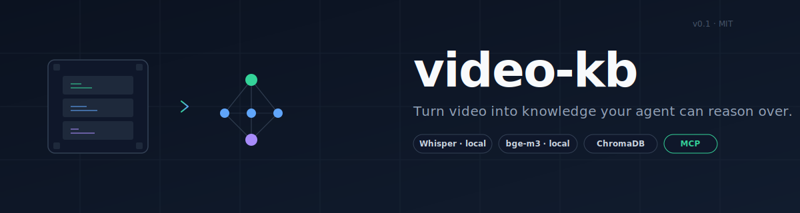
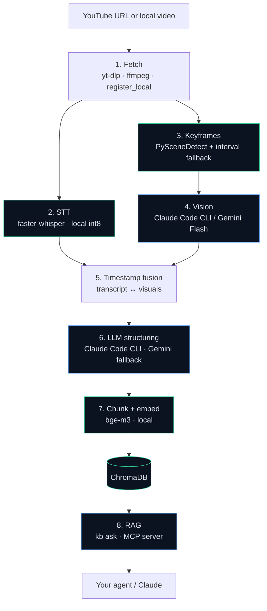

<div align="center">



# video-kb

**Turn any video — YouTube link or local file — into a citation-backed knowledge base your agent can actually reason over.**

[](./LICENSE)
[](https://www.python.org/downloads/)
[](https://modelcontextprotocol.io/)
[](#cost)
[](#roadmap)

</div>

---

## Why this exists

I wanted to build an **agent that actually learns** — one with reasoning ability, not a tangle of hand-written rules, regex, or a classifier that only knows what it was trained on. Reasoning needs an LLM. Learning needs knowledge the LLM doesn't already have. So I started with the knowledge problem.

Most of the material I'd want an agent to learn from lives in **video** — lectures, tutorials, conference talks, full courses. The auto-captions aren't enough, because half the content is on the whiteboard, in the code editor, or in the diagram the speaker is pointing at. An agent that only sees the transcript is blind to the pictures, and an agent that only sees the frames is deaf to the argument.

`video-kb` is the knowledge layer underneath. Feed it one video or a whole playlist, and it produces a **structured, citation-backed RAG** the agent can query. It understands what was **said**, what was **shown**, and what was **written** on screen — and every answer traces back to the exact second in the source so you can verify.

It runs end-to-end on your laptop at **\$0 / month**: Whisper does transcription locally, `bge-m3` does embeddings locally, Gemini's free tier handles vision, and Claude (via MCP) handles synthesis.

---

## What you get

- **Ingest anything** — YouTube URLs or local `.mp4/.mkv/.webm` files, single videos or whole playlists.
- **Multimodal understanding** — transcript + keyframe visual descriptions + aligned timestamps, not just captions.
- **Structured notes** — every video becomes a clean hierarchical outline, not a blob of text.
- **Semantic search across your library** — `bge-m3` + ChromaDB, fully local, no vector-db bill.
- **Answers with citations** — every claim carries a `[ep.N @ mm:ss]` back-reference. Always auditable.
- **Works *inside* Claude** — ships with an MCP server so Claude Code / Cowork / Desktop can query the KB as a native tool, no extra UI.
- **Zero recurring cost** — local models do the heavy lifting, the free / subscription tiers cover the rest.

---

## Quick start

Three commands. Example uses Andrej Karpathy's [*Neural Networks: Zero to Hero*](https://www.youtube.com/playlist?list=PLAqhIrjkxbuWI23v9cThsA9GvCAUhRvKZ) — the kind of multi-episode technical course this tool was built for.

```bash
# 1. Install (creates venv, installs deps, writes .env from template)
bash scripts/install.sh

# 2. Ingest a video (or pass a whole playlist URL)
kb ingest "https://www.youtube.com/watch?v=VMj-3S1tku0"   # "The spelled-out intro to neural networks"

# 3. Ask, with citations
kb ask "How is backpropagation implemented in micrograd?"
```

Sample answer:

```
Backpropagation in micrograd is implemented by attaching a local _backward
closure to every Value node when an op is applied [ep.1 @ 47:20]. Each
closure knows how to route the upstream gradient into its inputs — e.g.
for `+` it just forwards, for `*` it multiplies by the other operand
[ep.1 @ 49:05]. Calling .backward() on the final node then:
  1. topologically sorts the graph from that node [ep.1 @ 52:10]
  2. seeds its .grad to 1.0
  3. walks the sort in reverse, calling each node's _backward [ep.1 @ 53:40]

Karpathy contrasts this with PyTorch's autograd, which does the same thing
but with tensors instead of scalars and a C++ backend [ep.1 @ 01:12:30].

📎 Reference frames: ep.1 @ 47:20, 49:05, 52:10, 53:40, 01:12:30
```

Every `[ep.N @ mm:ss]` is a real back-reference — open the video at that timestamp and you'll see exactly the moment the claim came from.

<br/>

<div align="center">

| Command | What it does |
|---|---|
| `kb ingest <path-or-url>` | Process a local file or YouTube video end-to-end |
| `kb ask "..."` | Retrieval + LLM synthesis + citations |
| `kb query "..."` | Raw Top-K chunks as JSON (no LLM) |
| `kb list-videos` | Show everything in the library |
| `kb stats` | Vector DB stats (chunks, per-video counts) |
| `kb export <video_id>` | Bundle for drag-and-drop into a Claude Project |

</div>

---

## Ingest PDFs and images

Videos aren't the only thing that can go in. PDFs (lecture notes, papers, trading journals) and standalone images (chart screenshots, whiteboard photos, slides) land in the same ChromaDB as videos, and `kb ask` retrieves across all of them:

```bash
# Single PDF — default uses Claude CLI to extract (OCRs scans, describes charts, preserves tables)
kb ingest-doc trading_notes.pdf

# Large text-heavy PDF — skip Claude, use pypdf for a fast free pass
kb ingest-doc thesis.pdf --pdf-provider pypdf

# Single image — Claude vision describes the picture + transcribes any on-screen text
kb ingest-doc chart_screenshot.png

# Whole folder, recursive — picks up every .pdf / .png / .jpg / .jpeg / .webp / .bmp / .gif
kb ingest-doc ~/Desktop/trading_refs/
```

Citations in the answer tell you which source each claim came from:

| Format | Source |
|---|---|
| `[ep.3 @ 12:45]` | Video episode 3, 12 min 45 sec |
| `[trading_notes.pdf p.7]` | PDF, page 7 |
| `[img: chart_screenshot.png]` | Standalone image |

Manage ingested documents:

```bash
kb docs list                  # List every ingested PDF/image with chunk counts
kb docs remove pdf_<doc_id>   # Delete a doc's chunks from ChromaDB (confirms first)
kb docs remove pdf_<doc_id> -y  # Skip the confirmation (for scripts)
```

> ⚠️ **Cost note:** The Claude CLI provider uses your Max-plan allotment per PDF — roughly a few hundred tokens per page. Worth it for scanned PDFs and documents full of charts/tables. For pure-text PDFs (papers, books), `--pdf-provider pypdf` runs locally for free. Set `ingest_doc.pdf_provider` in `configs/default.yaml` to change the default.

---

## Use it from inside Claude (MCP)

The repo ships with a built-in MCP server that exposes four tools to Claude:

| Tool | Purpose |
|---|---|
| `kb_ask` | Retrieval + synthesis + citations |
| `kb_query` | Raw Top-K chunks (JSON) |
| `kb_list_videos` | What's in the library |
| `kb_stats` | Total chunks, per-video counts |

To wire it up to Claude Code, just launch Claude from the repo root — it auto-detects `.mcp.json` and prompts for approval:

```bash
cd video-kb
claude
```

Then, in any Claude Code / Cowork / Desktop conversation:

```
Search the video KB: how is backprop implemented in micrograd?
```

Claude picks `kb_ask` on its own and returns a fully cited answer. Same MCP config works for Cowork and Claude Desktop — paste it into their respective config files.

---

## Architecture



Every stage is a drop-in module — each provider (e.g. vision, structuring) lives at `src/kb/<stage>/<provider>.py` and follows the same signature. Swap Gemini for Claude or Claude for local Ollama with a config flip.

---

## Installation

### System requirements

- **Python 3.10+**
- **ffmpeg** — `brew install ffmpeg` / `apt install ffmpeg`
- **Claude Code CLI** *(optional, for zero-cost synthesis via a Max subscription)*:
  ```bash
  npm install -g @anthropic-ai/claude-code
  claude login
  ```
  If you'd rather use Gemini for everything, set `structuring.provider: gemini` and `ask.provider: gemini` in `configs/default.yaml`.

### Setup

```bash
git clone https://github.com/z-one1/video-kb.git
cd video-kb

# One-liner
bash scripts/install.sh

# Or manually
python3.10 -m venv .venv
source .venv/bin/activate
pip install -e .
```

First ingest downloads Whisper (~1.5 GB) and `bge-m3` (~2 GB) into `~/.cache/huggingface`. One-time cost, reused across all future videos.

### API key

```bash
cp .env.example .env
# Paste a free GEMINI_API_KEY from https://aistudio.google.com/apikey
```

### Health check

```bash
bash scripts/doctor.sh   # every item should be ✅ before the first kb ingest
```

---

## Configuration

Everything tunable lives in `configs/default.yaml`:

- Whisper model size / device / compute type
- Scene detection threshold, max frames per video (caps Gemini usage)
- Vision provider — `claude_code` / `gemini` / `none`
- Structuring provider — `claude_code` / `gemini`
- Chunking + embedding model parameters
- `kb ask` model, timeout, top-K

Defaults are tuned for **Apple Silicon, 16 GB RAM**.

---

## Cost

<a id="cost"></a>

At ~1–2 hours of video per day, this runs at **\$0 / month**.

| Stage | Tool | Cost |
|---|---|---|
| Transcription | faster-whisper (local int8) | Free |
| Vision | Gemini 2.5 Flash Lite (free tier) *or* Claude Max | Free / subscription |
| Structuring | Claude Code CLI (Max subscription) | Free / subscription |
| Embeddings | bge-m3 (local) | Free |
| Vector store | ChromaDB (local) | Free |
| Retrieval + answer | Claude via MCP | Free / subscription |

Gemini's free tier is 1500 requests / day — plenty for a typical 1–2 hour viewing habit.

---

## Output layout

```
video-kb/
├── kb/
│   ├── videos/<video_id>/
│   │   ├── video.mp4           # symlink or downloaded
│   │   ├── audio.wav           # 16 kHz mono
│   │   ├── meta.yaml
│   │   ├── transcript.{json,srt,md}
│   │   ├── frames/             # keyframe JPGs
│   │   ├── visuals.json        # per-frame descriptions
│   │   ├── enriched.{json,md}  # transcript aligned with visuals
│   │   ├── notes.{json,md}     # LLM-structured notes
│   │   └── chunks.jsonl        # ready for embedding
│   └── kb_db/                  # ChromaDB
└── claude_upload/<video_id>/   # drag-and-drop into a Claude Project
```

All output directories are `.gitignore`d — your personal videos and notes never leak into version control.

---

## Roadmap

**v0.1 (shipped).** End-to-end ingest pipeline, 8-stage processing, ChromaDB, `kb ask`, MCP server integration.

**v0.2 (next).**
- [ ] Alias dictionary for concept synonyms (queries using external vocabulary the speaker doesn't use)
- [ ] Short-chunk merging to raise signal density
- [ ] Streamlit query dashboard
- [ ] Watch-folder auto-ingest
- [ ] Speaker diarization via `pyannote.audio`

**Further out.** Agent loop on top of `video-kb` — iterative learning over multi-video curricula, with the agent deciding what to re-watch and what to ask next.

---

## Contributing

Issues and PRs welcome. Adding a new stage or provider? Follow the `src/kb/<stage>/<provider>.py` pattern — each provider is a drop-in module with the same function signature.

---

## License

[MIT](./LICENSE) — free for personal, research, and commercial use.

## Credits

Built on the shoulders of:

- [faster-whisper](https://github.com/SYSTRAN/faster-whisper) — local STT
- [PySceneDetect](https://github.com/Breakthrough/PySceneDetect) — keyframe detection
- [BAAI/bge-m3](https://huggingface.co/BAAI/bge-m3) — multilingual embeddings
- [ChromaDB](https://github.com/chroma-core/chroma) — vector store
- [MCP Python SDK](https://github.com/modelcontextprotocol/python-sdk) — Claude tool protocol
